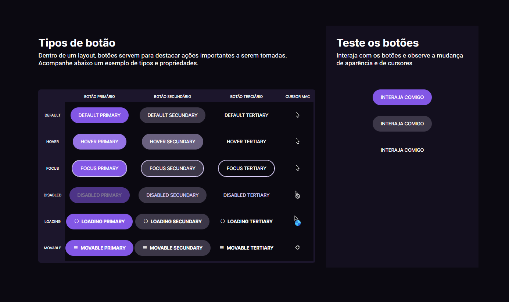

# Dev Links

> <b>Trilha Dev Links </b>

> Projeto feito no curso Dev Links do ano de 2023 - <b>DEV LINKS</b> Rocketseat :rocket:. 

## :hammer_and_wrench: Tecnologias

- HTML
- CSS
- Javascript
- Figma
- Git e Github

## :nut_and_bolt: Principais pontos abordados
### HTML
- Tags semânticas
### CSS
- Mobile first
- display flex
- Centralizar os elementos HTML usando FLEXBOX

### Javascript

- DOM
- Orientação a objetos;
- Estrutura de dados com objetos;
- Classes e muito mais.
- Funções em Javascript
- Clean Code
- Refatoração

## :dart:  Desafio

:heavy_check_mark:  A ideia aqui é você construir seu primeiro site seguindo o designer do figma com javascript, css e html que seja visualmente bonita que irá possibilitar o usuário cadastrar seus links pessoais  e suas redes sociais favoritas.

## :mailbox_closed: Contatos

> Email - rosendc30@gmail.com

> Linkedin - https://www.linkedin.com/in/francisco-rosendo-coelho/
